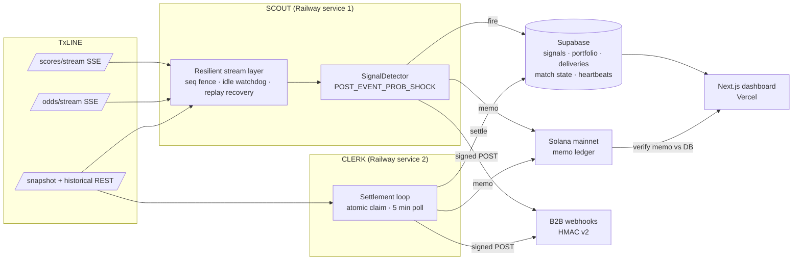
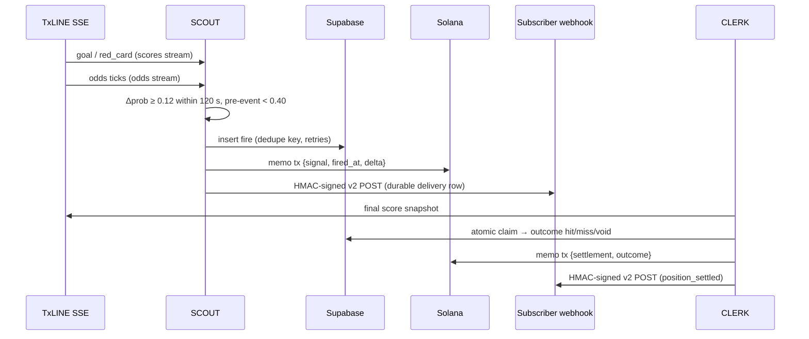

# VEILLE

**Two autonomous agents. One pre-registered signal. Opposite strategies. Every decision on-chain.**

VEILLE is a deterministic World Cup odds-signal engine built on [TxLINE](https://txline.txodds.com). **SCOUT** watches TxLINE's live scores and odds streams across every active match, detects a single pre-registered mathematical signal, records qualifying fires durably, writes each fire to Solana, and notifies B2B subscribers over signed webhooks. **CLERK** settles the resulting positions against final scores, writes settlement records to Solana, and recomputes outcome statistics. The two strategies read the same feed and take opposite sides of every fire — an agent-vs-agent arena where the tournament itself decides the winner.

Anyone can re-verify the published fires from raw TxLINE data without trusting this codebase: the repo ships an independent from-scratch verifier and the cached raw feeds it needs.

Built for the TxODDS World Cup Hackathon · Trading Tools & Agents Track · July 2026

- Live dashboard: https://veille-dashboard-nine.vercel.app
- Dashboard repo: https://github.com/TheWeirdDee/veille-dashboard
- Technical documentation: https://veille-dashboard-nine.vercel.app/docs

---

## Architecture



## The signal

One signal definition, `POST_EVENT_PROB_SHOCK`, was registered **before** any live fire and is locked append-only by a database trigger. Its `registered_at` timestamp and a Solana anchor transaction prove the parameters were not tuned after seeing results.

> Fires when the 1X2 implied probability of the newly favoured team rises by more than the threshold within the window after a goal or red card, where the pre-event probability implied that team was an underdog. Hypothesis: in-play markets systematically underreact to high-impact events when the beneficiary was previously unfancied.

| Parameter | Value | Meaning |
|---|---|---|
| `delta_threshold` | 0.12 | Minimum probability rise (12 percentage points) |
| `window_seconds` | 120 | Shift must complete within 120 s of the trigger event |
| `trigger_events` | goal, red_card | Only these events arm the detector |
| `lookback_seconds` | 180 | Pre-event baseline taken from the last tick before the trigger, within 180 s |
| `pre_event_prob_cap` | 0.40 | The favoured team must have been under 40 % before the event |
| `cooldown_seconds` | 300 | Per-match gate so one goal sequence cannot double-fire (reset at HT/FT) |

Every fire opens two positions from the same detection:

- **Strategy A** goes long the newly favoured team.
- **Strategy B** shorts the newly favoured team.

Identical inputs, opposite convictions. Over the tournament, the settled outcome record decides which side of the hypothesis was right.

### Signal lifecycle



## Results so far

Replaying the definition over 101 cached World Cup matches (raw TxLINE feeds committed for the verification matches, regenerable for the rest):

| | Fires | Hits | Misses | Net score |
|---|---|---|---|---|
| Strategy A (long the mover) | 79 | 44 | 35 | **+9** |
| Strategy B (short the mover) | 79 | 35 | 44 | −9 |

47 of 101 matches produced at least one fire. Live fires are recorded separately and are **never backfilled** — a missed live fire stays missed, and the gap is documented rather than papered over.

### What the metrics mean

A hit contributes `+1` and a miss `−1`. The stored `pnl_units`, `sharpe_ratio`, and drawdown columns are legacy names for this outcome score. They are **not** executable trading P&L: entry prices, stake sizing, fees, liquidity, and slippage are not modeled. The dashboard says the same thing.

## Integrity model

- The signal definition is append-only after registration and anchored on Solana.
- A deterministic dedupe key prevents duplicate signal rows; settlements use an atomic claim so concurrent CLERK instances cannot double-settle.
- Match state, last trigger, odds baseline, cooldown, and stream sequence are persisted, so a restart resumes detection instead of going blind.
- Signal and settlement side effects (Solana, webhooks) use durable per-delivery state plus startup reconciliation — transient failures retry, nothing is silently lost.
- Webhook v2 signs the exact raw body (`X-VEILLE-Signature`), carries a stable delivery ID and timestamp, and expects non-2xx on downstream failure so it retries.
- `scripts/independent-verify.ts` re-derives fires from raw TxLINE records with independent logic and compares **both directions**: unpublished fires it finds *and* published fires it cannot reproduce are discrepancies.
- Solana memos currently contain `txline_proof: null`: the agent feed does not yet supply a fetchable proof reference, and VEILLE does not claim native TxLINE proof validation until it does. The dashboard instead verifies each memo's fields against the database row and checks the signer wallet.

## TxLINE endpoints used

| Endpoint | Type | Used for |
|---|---|---|
| `POST /auth/guest` (guest JWT) | REST | Bearer token for all calls; auto-refresh on 401/403 |
| activation endpoint (Solana tx + wallet signature) | REST | One-time API token activation (`npm run activate`) |
| `/scores/stream` | SSE | Live match events: goals, cards, penalties, phase changes |
| `/odds/stream` | SSE | Live consensus 1X2 odds ticks |
| `/fixtures/snapshot?competitionId=…&startEpochDay=…` | REST | World Cup fixture discovery |
| `/scores/snapshot/{matchId}?asOf=…` | REST | Current match state on (re)connect and at settlement |
| `/scores/historical/{matchId}` | REST | Score-event backfill after reconnect/restart |
| `/odds/snapshot/{matchId}?asOf=…` | REST | Odds baseline recovery |
| `/{feed}/updates/{epochDay}/{hour}/{interval}` | REST | Interval backfill for replay caching |
| `/scores/stat-validation?fixtureId=…&seq=…&statKey=…` | REST | Merkle proof fetch (implemented; unused until proof references land in the feed) |

Feed handling notes discovered the hard way: scored penalties arrive as `penalty_outcome` (never a `goal` action) and must be mapped; bookmakers suspend the 1X2 market for ~2–3 minutes around goals, so the odds window must anchor at the trigger event, not the clock; SSE sockets can go half-open silently (idle watchdog required); snapshots intermittently return 403 and need a JWT refresh, not just on 401.

## Repository layout

```
src/agents/scout.ts        SCOUT: streams → detector → durable fire pipeline
src/agents/clerk.ts        CLERK: settlement loop with atomic claims
src/lib/signal-detector.ts The registered signal, deterministic and replayable
src/lib/resilient-stream.ts Restart/reconnect recovery around the SSE feeds
src/lib/txline/            Auth, streams, snapshots, normalization, replay
src/lib/onchain.ts         Solana memo ledger (signal + settlement)
src/lib/subscribers.ts     Idempotent HMAC v2 webhook delivery
src/lib/portfolio.ts       Outcome-score statistics per strategy
scripts/independent-verify.ts  From-scratch fire re-derivation (shown on /verify)
scripts/test-engine.ts     Deterministic offline engine tests
scripts/test-integration.ts    Read-only live checks (no writes, no SOL spent)
supabase/schema.sql        Full schema: tables, RLS, outbox, constraints
data/replay-cache/         Committed raw TxLINE records for verification matches
data/backtest/             101 precomputed match replays rendered by the dashboard
```

## Setup

Requires Node.js 22 or newer.

```bash
npm ci
copy env.example .env
npm run activate
```

Apply both SQL files in the Supabase SQL editor before starting an agent:

1. `supabase/schema.sql`
2. `supabase/heartbeat.sql`

Then register and anchor the definition once, and initialize both portfolio rows:

```bash
npm run register-signal
npx tsx scripts/anchor-registration.ts
npm run init-portfolio
```

The registry trigger rejects later updates or deletes. Keep the registration transaction signature and configured wallet public key available to the dashboard verifier.

## Run and verify

```bash
npm run build          # tsc
npm run test:engine    # deterministic, offline
npm test               # read-only live checks: TxLINE, Supabase, webhook loopback
npm run scout
npm run clerk
```

Replay one cached match instantly, then re-derive its fires with the independent verifier:

```bash
npm run replay -- 18222446
npx tsx scripts/independent-verify.ts 18222446
```

## Webhook v2

The JSON body contains:

```typescript
{
  veille_version: 2,
  delivery_id: string,
  sent_at: number,
  event: 'signal_fired' | 'position_settled',
  signal_id: string,
  strategy: 'A' | 'B',
  match_id: string,
  home_team: string,
  away_team: string,
  trigger_event: 'goal' | 'red_card',
  trigger_minute: number,
  favoured_team: 'home' | 'away',
  position: 'long_home' | 'long_away' | 'short_home' | 'short_away',
  pre_event_prob: number,
  post_signal_prob: number,
  delta: number,
  onchain_tx: string,
  txline_proof: string,
  fired_at: number,
  outcome?: 'hit' | 'miss' | 'void'
}
```

Verify `HMAC-SHA256(rawRequestBody, subscriberSecret)` against `X-VEILLE-Signature` with constant-time comparison. Reject stale `X-VEILLE-Timestamp` values and deduplicate `X-VEILLE-Delivery-Id`. Return a non-2xx status when downstream processing fails so VEILLE retries.

## Deploy: two Railway services

Create two services from the same repository and migration state, and point each at its config file (Settings → Config-as-code):

- `veille-scout` → `railway.scout.json` (starts `npm run scout`)
- `veille-clerk` → `railway.clerk.json` (starts `npm run clerk`)

Both need the TxLINE, Supabase, and Solana environment variables in `env.example`. Use the same wallet and database, deploy the schema first, and keep the restart policy at `ON_FAILURE`. The build command is `npm run build` only — Nixpacks already runs `npm ci` in its install phase, and repeating it in the build phase collides with the mounted `node_modules/.cache` volume (EBUSY). A deployment is healthy only when both rows in `veille_agent_heartbeat` stay fresh.

## Security

Only trusted server processes use the Supabase service role. RLS is enabled on all VEILLE tables with no public policies. Subscriber URLs must be HTTPS, secrets must never reach the dashboard/browser, and integration tests are read-only by default.

`npm audit` reports transitive findings inside the pinned Solana v1 stack (`bigint-buffer` via `@solana/spl-token`, `uuid` via `jayson`/`@solana/web3.js`). The available fixes are breaking downgrades, and the affected code paths are not reachable from agent runtime input: the agents only sign and submit memo transactions, and `@solana/spl-token`/`@coral-xyz/anchor` are used solely by the one-time local `npm run activate` script. Re-evaluate when migrating to `@solana/kit`.
